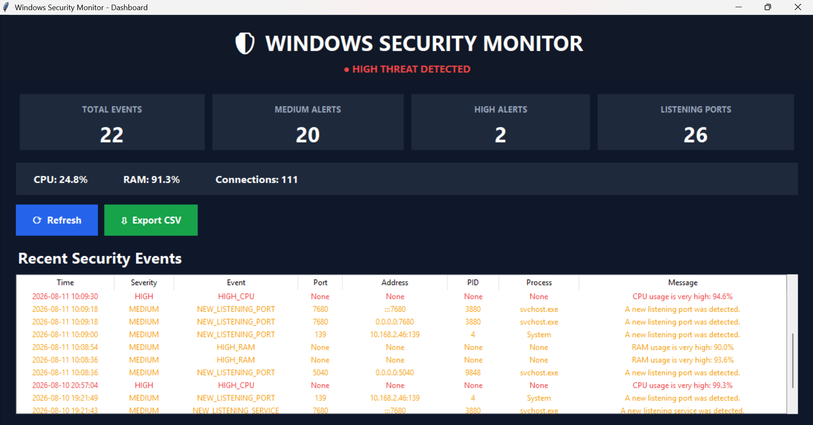

# 🛡️ Windows Security Monitor

> A lightweight Python-based Windows security monitoring application for monitoring system resources, processes, network connections, and listening ports.


---

## 📌 Overview

**Windows Security Monitor** is a lightweight security monitoring system developed using Python.

The application collects basic system and security-related information from a Windows computer and presents it through an easy-to-use graphical dashboard.

It is designed as an **educational cybersecurity project** to demonstrate how system monitoring and basic security detection can be implemented using Python.

---

## ✨ Features

### 🖥️ System Monitoring

- Monitor CPU usage
- Monitor RAM usage
- Display system resource utilization
- Monitor basic system activity

### ⚙️ Process Monitoring

- View currently running processes
- Display process information
- Monitor process activity
- Identify resource-intensive processes

### 🌐 Network Monitoring

- View active network connections
- Display network connection information
- Monitor network activity
- Identify local and remote endpoints

### 🔌 Port Monitoring

- Detect listening ports
- Display port information
- Identify services listening on the system
- Detect newly observed listening services

### 🛡️ Security Monitoring

- Perform basic security checks
- Generate security alerts
- Calculate a basic threat score
- Detect suspicious system activity
- Monitor unusually high CPU/RAM usage
- Track changes in listening services

### 📊 Dashboard

- Simple graphical user interface
- Real-time monitoring information
- Security event history
- Threat-level display
- Network and port information

---

## 📸 Dashboard Preview



---

## 🛠️ Technologies Used

| Technology | Purpose |
|---|---|
| **Python 3** | Core programming language |
| **Tkinter** | Graphical user interface |
| **Psutil** | System, process and network monitoring |
| **SQLite** | Local event database |
| **JSON** | Baseline configuration |
| **CSV** | Security event export |
| **Windows OS** | Target operating system |

---

## 📂 Project Structure

```text
Windows-Security-Monitor/
│
├── dashboard.py          # Graphical dashboard
├── database.py           # SQLite database operations
├── monitor.py            # System/process/network monitoring
├── security.py           # Security checks and threat assessment
├── requirements.txt      # Python dependencies
├── README.md             # Project documentation
├── .gitignore            # Git ignored files
│
└── screenshots/
    └── dashboard.png     # Dashboard screenshot
```

---

## 🚀 Installation

### 1. Clone the Repository

```bash
git clone https://github.com/kanishk-2010-tech/Windows-Security-Monitor.git
```

### 2. Enter the Project Directory

```bash
cd Windows-Security-Monitor
```

### 3. Install Dependencies

```bash
pip install -r requirements.txt
```

---

## ▶️ How to Run

Run the dashboard using:

```bash
python dashboard.py
```

The graphical security monitoring dashboard will open.

---

## 🔍 How It Works

The application follows a simple monitoring workflow:

```text
Windows System
      │
      ▼
   Psutil
      │
      ├── CPU / RAM
      │
      ├── Running Processes
      │
      ├── Network Connections
      │
      └── Listening Ports
      │
      ▼
 Security Analysis
      │
      ├── Security Checks
      ├── Threat Assessment
      └── Alert Generation
      │
      ▼
 SQLite Database
      │
      ▼
 Tkinter Dashboard
```

---

## 🛡️ Security Monitoring

The security module performs basic checks on monitored system activity.

Examples include:

- High CPU usage
- High memory usage
- New listening services
- Potentially unusual system activity
- Changes from the configured baseline

The application can assign a basic **threat score** based on detected security events.

> **Note:** This project is a basic monitoring system and should not be considered a replacement for professional antivirus, EDR, SIEM, or enterprise security solutions.

---

## 📊 Data Storage

Security events can be stored locally using **SQLite**.

The project can also use:

- **JSON** for baseline configuration
- **CSV** for exporting security events

This allows monitoring data to remain available for later analysis.

---

## 🎯 Project Objectives

The main objectives of this project are:

- Understand Windows system monitoring
- Learn Python-based cybersecurity development
- Monitor processes and system resources
- Understand network connections and listening ports
- Implement basic security detection
- Store security events locally
- Build a simple security dashboard

---

## 🔮 Future Improvements

Possible future improvements include:

- 🔔 Real-time desktop notifications
- 📧 Email security alerts
- 📈 Historical CPU/RAM graphs
- 🔎 Advanced process analysis
- 🌐 IP reputation checking
- 🦠 Malware detection integration
- 📋 Detailed security event logs
- 🔐 User authentication
- 📊 Advanced threat analytics
- 🖥️ Improved dashboard UI

---

## ⚠️ Disclaimer

This project is developed for **educational and cybersecurity learning purposes**.

It is intended to monitor systems where the user has appropriate authorization.

The project should not be used to monitor or inspect systems without permission.

---

## 👨‍💻 Author

**Kanishk Soni**

Cybersecurity Student & Developer

---

## ⭐ Support

If you find this project useful for learning cybersecurity or Python system monitoring, consider giving the repository a ⭐.
